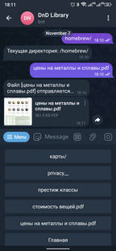

## lib_bot  
Bot to access the library for normal users (contained in players) and its hidden sections (if any) for the main user.  

---
### Result of work  
+ Go to main  
[](images/main.png)  

+ Go to dir  
[](images/dir.png)  

+ Get file  
[](images/file.png)  


---
### Install  
To start using this bot:  

1. Create file list for files larger than 49MB:  
```
find "$(pwd)" -type f -size +49M > telebot_size_limit
```
Now, if file larger than 49MB, you receive message (file larger than 50MB not sent with telebot).  

---

2. Create file tree lib folder and put tree.json in bot folder:  
```
tree -J > tree.json
```

---

3. In telebot_dispatcher.py change lib_dir (line 15) to path to your lib folder.  

---

4. Create telegram bot:  
4.1. Add [BotFather](https://t.me/BotFather) to your telegram.  
4.2. Send /newbot to create new bot.  
4.3. Enter your bot name.  
4.4. Enter your bot login.  
4.5. Paste in telegram_token your bot token.  
4.6. Next push Edit Bot -> Edit Commands, enter next command (send in one message):  
```
reg - Register user.
home - Go to library root.
```

---

5. Create file 'credential' and insert your password encrypted with sha256, or edit password in password.py (line 3) and run it.  

---

6. Create file 'players' and add players like this:  
```
first_player
second_player
super_player
```

---

7. Create file 'users_path.json' with content:  
```
{}
```
---

8. Launch bot:  
```
python3 dnd_lib_bot.py
```

---

9. If you need to hide some files in a folder (or subfolders) for ordinary users, then in this folder you need to create a file named privacy__ and with the following content:  
```
first_folder
second_folder
file
another_file
```
Or just one line to hide all files and subfolders:  
```
all_in_folder
```

---

10. Now, when registering with the bot, you need to select the player you are or the master and enter the password or player name, if it matches, start using the bot.  